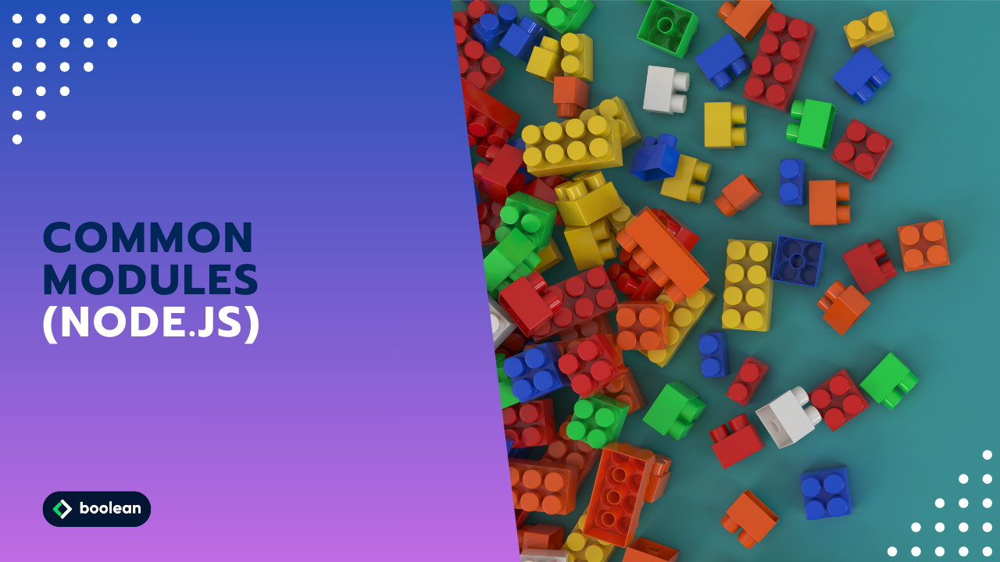

 
Trentaduesimo Esercizio Classe #137 - Boolean

---

Studente: Fabio Ferrero

---
# English

## Target of the project:
We work with commonjs modules by exporting and importing values and functions. Follow these three steps by creating the respective files:
**names.js**
1. Create a function that accepts two parameters: firstName, lastName. The function should return an object with the properties firstName and lastName.
2. Export the function from the file.

**hobbies.js**
1. Create a function that accepts three parameters: hobbyOne, hobbyTwo, hobbyThree. The function should return an object with a hobbies property, which is an array of hobbies.
2. Export the function from the file.

**people.js**
1. Import your function from names.js
2. Import your function from hobbies.js
3. Create a function that has no parameters. The function should return an object with two properties: fullName and hobbies. Within your function, use your previous two functions to build the object.

---
# Italiano

## Obiettivo del progetto:
Lavoriamo con i moduli commonjs esportando e importando valori e funzioni. Segui questi tre step creando i rispettivi files:
**names.js**
1. Crea una funzione che accetta due parametri: firstName, lastName. La funzione dovrebbe restituire un oggetto con le proprietà firstName e lastName.
2. Esporta la funzione dal file.

**hobbies.js**
1. Crea una funzione che accetta tre parametri: hobbyOne, hobbyTwo, hobbyThree. La funzione dovrebbe restituire un oggetto con una proprietà hobbies, che è un array di hobby.
2. Esporta la funzione dal file.

**people.js**
1. Importa la tua funzione da names.js
2. Importa la tua funzione da hobbies.js
3. Crea una funzione che non ha parametri. La funzione dovrebbe restituire un oggetto con due proprietà: fullName ed hobbies. All’interno della tua funzione, usa le tue due funzioni precedenti per costruire l’oggetto.

---

